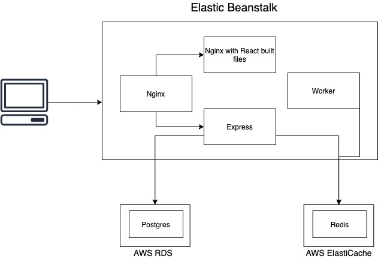

### TODO:
- Read and understand travis config
- Read and understand docker-compose file
- Read K8s docs (especially concept part) and K8s in action


#### AWS Elastic Beanstalk Multiplecontainer Docker
 - To deploy multiple container running on one EC2 instance using Elastic Beanstalk, we need a `Dockerrun.aws.json` configuration file, which is specific to Elastic Beanstalk.
 - When writting the configuration file, note that we have to specify `AWSEBDockerrunVersion=2`, because version 2 is to handle multiple container. The format differs significantly from the previous version 1.
 - Further reading: https://docs.aws.amazon.com/elasticbeanstalk/latest/dg/create_deploy_docker_ecs.html

#### Nginx Configuration
 - To handle path routing/load balancing we can use Nginx, which can be used by simply writting a config file, in this application it is the `nginx/default.conf` file.
 - Further reading: https://docs.nginx.com/nginx/admin-guide/load-balancer/http-load-balancer/
 - Inside the file, we have 2 kind of directives, `upstream` and `server`
       - The `upstream` directive is to specify a group of server that will handle the traffic.
       - Below is a group named client and only consists of 1 server client host on port 3000, noted that the `server` directive here is diferent from the outer `server` directive. Here, the `server` is just a list of server (in this application, the server name is taken from the container name set by the `docker-compose.yml` file) that will handle the traffic passed to this group.
        ```
        upstream client {
            server client:3000;
        }
        ```
        - The `server` (outer) directive is to list all the path routing config to a virtual server running on Nginx. The `location` is followed by a template of incoming traffic, and the `proxy_pass` indicates the `upstream` group that will handle that request.
        - In the snippet below, the server will route all request prefix with `/api` to the `api` upstream group and the remaining requests will be handle by the `client` upstream group.

        server {
            location / {
                proxy_pass http://client;
            }

            location /api {
                proxy_pass http://api;
            }
        }
        
                 

### Architecture:
